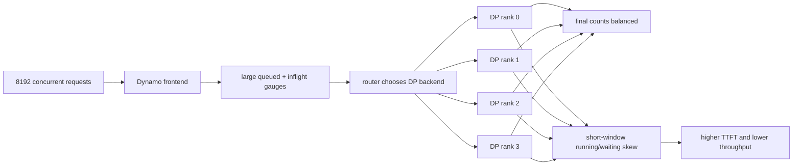

# Dynamo DP Imbalance Final Report

Date: 2026-05-24

## Conclusion

The performance gap reproduces on Lyris GB200. On clean, non-instrumented runs,
the best Dynamo variant reached 49.31k output tok/s while direct vLLM reached
58.23k output tok/s, a 15.3% Dynamo throughput deficit. The TTFT gap also
reproduces: best Dynamo mean TTFT was 98.94 s versus 75.42 s for direct vLLM
api4 and 61.15 s for direct vLLM api8.

The data does not support simple final DP-rank count imbalance as the root
cause. Round-robin Dynamo finished with nearly perfect per-rank request counts,
yet still had lower throughput and much higher TTFT. The stronger signal is
temporal imbalance: short windows show large running/waiting skew between ranks
while final counts remain balanced.

## Test Results

| Run | Job/session | Output tok/s | Req/s | Mean TTFT | P99 TTFT | Mean TPOT | Mean ITL | DP count signal |
|---|---|---:|---:|---:|---:|---:|---:|---|
| Dynamo round robin | 1859591 | 49,263.13 | 48.11 | 99.92 s | 188.38 s | 57.48 ms | 71.83 ms | 24576,24577,24576,24578 |
| Dynamo least-loaded | 1859711 | 49,309.21 | 48.15 | 98.94 s | 156.63 s | 62.74 ms | 70.10 ms | 25270,24255,24447,24335 |
| Dynamo dedicated KV | 1859688 | 48,990.56 | 47.84 | 103.81 s | 187.54 s | 57.64 ms | 66.44 ms | 24688,24629,24607,24383 |
| Direct vLLM api4/default | 1859427 | 58,227.52 | 56.86 | 75.42 s | 373.39 s | 62.25 ms | 71.20 ms | 24579,24576,24576,24576 |
| Direct vLLM api8 | 1864796 | 58,043.19 | 56.68 | 61.15 s | 250.42 s | 68.00 ms | 69.05 ms | 24579,24568,24582,24578 |
| Dynamo traced round robin | 1880624 | 38,111.10 | 37.22 | 146.46 s | 274.66 s | 61.07 ms | 89.82 ms | 24577,24577,24577,24576 |
| Dynamo traced least-loaded | 1880901 | 35,772.70 | 34.93 | 147.83 s | 252.44 s | 76.65 ms | 93.26 ms | final trace summary not run |

The traced runs are observability runs, not clean throughput comparisons. They
used source-installed Dynamo, request trace logging, client JSONL tracing, and
metrics scraping.

## Charts

Throughput, higher is better:

```text
Direct api4        58.23k | ##################################################
Direct api8        58.04k | #################################################
Dynamo least       49.31k | ##########################################
Dynamo round robin 49.26k | ##########################################
Dynamo KV          48.99k | ##########################################
Traced round robin 38.11k | ################################
Traced least       35.77k | ##############################
```

Mean TTFT, lower is better:

```text
Direct api8        61.15s | ####################
Direct api4        75.42s | ########################
Dynamo least       98.94s | ################################
Dynamo round robin 99.92s | ################################
Dynamo KV         103.81s | ##################################
Traced round robin 146.46s | ################################################
Traced least       147.83s | ################################################
```

Observed failure shape:



## Queue And Skew Data

| Run | Request-plane queue | Send | Roundtrip TTFT | Frontend queued max/mean | Temporal skew signal |
|---|---:|---:|---:|---:|---|
| Dynamo round robin | 0.000026 s | 0.060 s | 70.20 s | 5330 / 3093 | final counts balanced, TTFT still high |
| Dynamo least-loaded | 0.000027 s | 0.052 s | 76.41 s | 6574 / 3642 | load-aware count balance did not close gap |
| Dynamo dedicated KV | 0.000017 s | 0.055 s | 78.46 s | 6039 / 3642 | 42.9 ms mean router scheduling overhead |
| Traced round robin 1880624 | 0.108 s | 0.041 s | 141.46 s | 7243 / 4988 | running skew max 794; waiting skew max 864 |
| Traced least-loaded 1880901 | 0.186 s live | 0.021 s live | 137.44 s live | 6964 max / 5504 last | running skew max 680; waiting skew max 825 |

The local request-plane queue and send costs are too small to explain tens of
seconds of TTFT gap. The backlog shows up as frontend queued/inflight pressure
and backend temporal skew, not as a local enqueue bottleneck.

## Analysis

Even distribution does not fix TTFT skew. Round robin assigned almost exactly
the same number of requests to each backend process, but it still lost about
15% throughput to direct vLLM and added 24 to 38 s of mean TTFT.

The likely issue is timing: requests may be admitted or replenished unevenly
across DP ranks, and the Dynamo router may act on backend load information that
is too stale or too coarse for this high-concurrency decode-heavy workload.
This aligns with the traced queue summaries: aggregate rank means look close,
but short windows show hundreds of requests of running/waiting skew.

The dedicated KV router is not a good fit for this benchmark. The workload has
`isl=2`, `osl=1024`, no prefix caching, and random prompts, so there is little
KV locality to exploit. It added scheduling overhead and did not improve
throughput or TTFT.

Direct vLLM api8 mainly improved TTFT, not throughput. That suggests frontend
admission/API parallelism can reduce time-to-first-token without changing the
underlying decode throughput much.

## Remaining Gaps

No current Dynamo CLI mode named `token-dp-balance` was present. Dynamo already
has token-aware load accounting in the KV-router path through `--load-aware`,
`--router-track-prefill-tokens`, and optionally `--router-track-output-blocks`.
That path should be tested instead of adding a duplicate runtime mode.

Per-DP-rank TTFT and router state freshness were not directly emitted. The next
most valuable metrics are selected backend, load-state age at scheduling time,
per-rank running/waiting depth, and request timestamps for backend enter,
first token, and completion.

## Artifacts

All successful run artifacts are on persistent Lyris Lustre:

| Run | Output path |
|---|---|
| 1859591 | `/lustre/fsw/coreai_dlfw_dev/connorc/srt-slurm/outputs/1859591` |
| 1859711 | `/lustre/fsw/coreai_dlfw_dev/connorc/srt-slurm/outputs/1859711` |
| 1859688 | `/lustre/fsw/coreai_dlfw_dev/connorc/srt-slurm/outputs/1859688` |
| 1859427 | `/lustre/fsw/coreai_dlfw_dev/connorc/srt-slurm/outputs/direct-vllm/default` |
| 1864796 | `/lustre/fsw/coreai_dlfw_dev/connorc/srt-slurm/outputs/direct-vllm/api8-final` |
| 1880624 | `/lustre/fsw/coreai_dlfw_dev/connorc/srt-slurm/outputs/1880624` |
| 1880901 | `/lustre/fsw/coreai_dlfw_dev/connorc/srt-slurm/outputs/1880901` |
