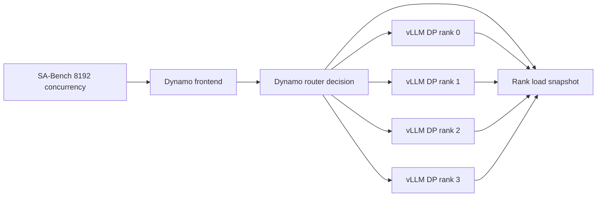

# Post-PR 9915 Dynamo/vLLM DP Imbalance Rerun

Date: 2026-05-26

> Superseded correction: job `1918158` reran the post-PR 9915 round-robin
> workload with the intended `stream-interval: 50` setting and did not reproduce
> the performance gap. Use `POST-9915-STREAM-INTERVAL-50-REPORT.md` for the
> corrected conclusion. The data below is retained as the no-stream-interval
> incomplete validation record.

## Executive Summary

Correction, 2026-05-26: the completed post-9915 rerun recipes did not set
`stream-interval`. PR 9915 propagates vLLM `--stream-interval` into Dynamo's
frontend output processor, and the relevant PR-side vLLM recipe pattern uses
`--stream-interval 50`. Therefore the completed jobs below prove only that the
post-9915 source hash was present; they do **not** conclusively test the
intended PR 9915 performance path. The post-9915 recipes have been patched with
`stream-interval: 50` and need to be rerun.

The PR 9915 fix was included in the Dynamo revision used for the rerun, but it
did not resolve the high-concurrency DP=4 EP performance gap. The best
post-9915 Dynamo result was round robin at 41.24k output tok/s, still 29.2%
below the prior direct-vLLM api4 control and 16.3% below the earlier clean
Dynamo round-robin run.

The remaining issue is not explained by local frontend queue/send overhead.
The dominant symptom is still very high TTFT, with backend logs showing DP ranks
periodically draining to `Waiting: 0` and running below the `max-num-seqs=864`
ceiling. That points to temporal DP-rank underfeed/refill imbalance, not a
simple final request-count imbalance.

PR 9915 appears to address token streaming overhead after generation begins. It
does not directly change Dynamo's router admission loop, DP-rank selection, load
snapshot freshness, backend slot refresh, or the feedback path that decides
when drained DP ranks receive new requests. Those are the paths implicated by
the rerun.

## What Was Tested

All post-9915 Dynamo runs used:

- Cluster: Lyris GB200, 1 node, 4 GPUs
- Model:
  `/lustre/share/coreai_dlfw_dev/models/Qwen3-235B-A22B-Instruct-2507-FP4`
- Runtime image: `nvcr.io/nvidia/ai-dynamo/vllm-runtime:1.1.0`
- Dynamo source hash: `916ac5971d26976bfca76fd479f2247158e10df7`
- vLLM backend: DP=4, EP enabled, FP8 KV cache, modelopt quantization
- Backend limits: `max-num-seqs=864`, `max-num-batched-tokens=2048`,
  `max-model-len=2048`
- Intended PR 9915 validation setting: `stream-interval=50`. This was missing
  from completed jobs `1912381`, `1913159`, and `1913660`; local recipes are now
  patched for the next rerun.
- SA-Bench: `isl=2`, `osl=1024`, concurrency `8192`, chat template disabled

Three Dynamo variants were rerun:

| Variant | Job | Router config |
|---|---:|---|
| Round robin | 1912381 | multiple frontends, default routing |
| Least-loaded | 1913159 | multiple frontends, `router-mode=least-loaded` |
| Dedicated KV router | 1913660 | single frontend, `router-mode=kv`, queue threshold 64, no KV events |

The direct-vLLM controls were not rerun in this pass. They are the prior clean
controls from the same reproduction effort. That comparison is still useful
because the changed component being tested here is Dynamo, and all post-9915
Dynamo runs also regressed versus the earlier clean Dynamo runs.

## Did PR 9915 Take Effect?

Yes. The submitted recipes set:

```yaml
dynamo:
  install: true
  hash: "916ac5971d26976bfca76fd479f2247158e10df7"
```

Local git verification showed PR 9915's squash commit,
`2b980ba10c refactor: Use delta output kind for vLLM token streaming (#9915)`,
is an ancestor of the pinned test hash. The run log also recorded source
installation from that hash.

The relevant PR code path changes Dynamo's vLLM integration to request
`RequestOutputKind.DELTA` and to treat each vLLM response chunk as a token
delta rather than slicing cumulative token lists. In effect, this reduces
streaming payload/processing pressure after a request has already entered vLLM
and begun producing output.

That code was present in these runs, but the benchmark did not set
`stream-interval`, so the frontend may have used the low/default streaming
interval instead of the PR recipe's intended chunking behavior. The result
therefore cannot be used as final evidence that PR 9915 failed to address
throughput.

## Results

| Run | Job/session | Output tok/s | Req/s | Mean TTFT | P99 TTFT | Mean TPOT | Mean ITL |
|---|---:|---:|---:|---:|---:|---:|---:|
| Direct vLLM api4/default, prior control | 1859427 | 58,227.52 | 56.86 | 75.42 s | 373.39 s | 62.25 ms | 71.20 ms |
| Direct vLLM api8, prior control | 1864796 | 58,043.19 | 56.68 | 61.15 s | 250.42 s | 68.00 ms | 69.05 ms |
| Dynamo round robin, prior clean | 1859591 | 49,263.13 | 48.11 | 99.92 s | 188.38 s | 57.48 ms | 71.83 ms |
| Dynamo least-loaded, prior clean | 1859711 | 49,309.21 | 48.15 | 98.94 s | 156.63 s | 62.74 ms | 70.10 ms |
| Dynamo dedicated KV, prior clean | 1859688 | 48,990.56 | 47.84 | 103.81 s | 187.54 s | 57.64 ms | 66.44 ms |
| Dynamo round robin, post-9915 | 1912381 | 41,237.16 | 40.27 | 141.56 s | 304.86 s | 46.65 ms | 64.93 ms |
| Dynamo least-loaded, post-9915 | 1913159 | 36,097.19 | 35.25 | 140.55 s | 244.83 s | 80.20 ms | 96.52 ms |
| Dynamo dedicated KV, post-9915 | 1913660 | 37,768.10 | 36.88 | 150.02 s | 275.58 s | 55.27 ms | 81.08 ms |

Throughput, higher is better:

```text
Direct api4 prior        58.23k | ##################################################
Direct api8 prior        58.04k | #################################################
Dynamo least prior       49.31k | ##########################################
Dynamo RR prior          49.26k | ##########################################
Dynamo KV prior          48.99k | ##########################################
Dynamo RR post-9915      41.24k | ###################################
Dynamo KV post-9915      37.77k | ################################
Dynamo least post-9915   36.10k | ###############################
```

Mean TTFT, lower is better:

```text
Direct api8 prior        61.15s | ####################
Direct api4 prior        75.42s | ########################
Dynamo least prior       98.94s | ################################
Dynamo RR prior          99.92s | ################################
Dynamo KV prior         103.81s | ##################################
Dynamo least post-9915  140.55s | ##############################################
Dynamo RR post-9915     141.56s | ###############################################
Dynamo KV post-9915     150.02s | #################################################
```

## Did The Fix Work?

No, not for the reported DP imbalance/routing-performance gap.

Post-9915 round robin was the best new Dynamo run, but it was still:

- 29.2% below prior direct vLLM api4 throughput
- 29.0% below prior direct vLLM api8 throughput
- 16.3% below the earlier clean Dynamo round-robin run

Least-loaded and dedicated KV did not improve the result:

- Least-loaded: 36.10k output tok/s, 140.55 s mean TTFT
- Dedicated KV: 37.77k output tok/s, 150.02 s mean TTFT

The fix may have helped part of the decode streaming path. For example,
post-9915 round robin had lower mean TPOT than the earlier Dynamo round-robin
run (`46.65 ms` versus `57.48 ms`). However, the workload remains dominated by
TTFT/admission delay, not steady-state per-token emission cost.

## Remaining Symptoms

### 1. TTFT Is Still The Dominant Gap

The best post-9915 Dynamo mean TTFT was about 140-142 s. The prior direct-vLLM
api8 control was 61.15 s, and the earlier clean Dynamo variants were about
99-104 s.

This means requests are waiting far too long before first token, even though
once generation begins some TPOT numbers are not obviously worse.

### 2. Backend DP Ranks Still Drain

Backend logs showed the same temporal underfeed shape as the original report:

- early measured phase: all four DP ranks reached `Running: 864` with nonzero
  waiting queues
- later measured phase: ranks repeatedly reached `Waiting: 0`
- during those windows, `Running` often fell into the 300-700 range, below the
  configured `max-num-seqs=864`

For job `1913660`, observed examples included rank states around:

```text
Running: 497, Waiting: 0
Running: 548, Waiting: 0
Running: 528, Waiting: 0
Running: 385, Waiting: 0
```

With concurrency 8192 and DP=4, the backend should have enough demand to keep
all ranks continuously fed if admission/refill is keeping up. Seeing `Waiting:
0` and `Running < 864` means at least some DP ranks have available capacity but
are not receiving work quickly enough at that moment.

### 3. Frontend Send/Queue Overhead Is Too Small To Explain The Gap

Extracted request-plane metrics:

| Run | Request-plane queue mean | Send mean | Roundtrip TTFT mean |
|---|---:|---:|---:|
| Round robin 1912381 | 91.53 ms | 17.52 ms | 115.82 s |
| Least-loaded 1913159 | 83.10 ms | 26.98 ms | 127.81 s |

The frontend enqueue/send means are milliseconds to tens of milliseconds. The
roundtrip-to-first-token path is hundreds of seconds. That strongly argues
against local HTTP enqueue or request-plane send serialization as the main
cause.

The dedicated KV run completed successfully, but final request-plane histogram
sums were not extracted before the Lyris socket became unreliable. Its result
and backend queue evidence were captured; the final scrape is still in the job
output directory.

### 4. Static Final Distribution Is Not Enough

Earlier clean round-robin data had near-perfect final per-rank request counts:

```text
24576, 24577, 24576, 24578
```

That still produced a large throughput/TTFT gap. The relevant failure mode is
therefore temporal: when each rank gets work and how long it spends underfilled,
not only how many total requests each rank receives by the end.

## Why The Issue Likely Remains

The current evidence points to a refill/admission feedback problem between the
Dynamo router/frontends and vLLM DP ranks.

At this workload shape, each DP rank can run up to 864 sequences, so four ranks
can run up to 3456 active sequences. SA-Bench submits 8192 concurrent requests,
so there is enough demand to maintain a waiting queue while ranks finish and
free slots. In the direct-vLLM setup, vLLM's own API/server/scheduler stack has
nearer access to internal DP scheduler state and can refill freed capacity
without going through Dynamo's external routing path.

Dynamo adds an additional routing/admission layer:



If the router's view of rank capacity is stale, coarse, or refreshed in bursts,
it can make individually reasonable decisions that still leave ranks underfed
for short windows. Those windows accumulate into lower throughput and higher
TTFT under a very large concurrent burst.

This also explains why the router variants did not fix the issue:

- Round robin can balance final counts but still miss temporal slot openings.
- Least-loaded depends on timely load snapshots; stale snapshots can make it
  chase old state and still refill unevenly.
- Dedicated KV mode with KV overlap weight disabled does not address the basic
  rank-slot freshness problem, and it performed worse than round robin here.

PR 9915 does not alter that feedback loop. It changes how generated tokens are
streamed once vLLM is already emitting output. The observed bottleneck is mostly
before first token, during admission/refill and rank queueing.

## What Is Proven vs Inferred

Proven by this rerun:

- PR 9915 was included in the tested Dynamo source revision.
- The post-9915 Dynamo variants remained below prior direct-vLLM controls.
- All post-9915 Dynamo variants remained below earlier clean Dynamo throughput.
- Backend logs still showed DP ranks draining to `Waiting: 0` with `Running`
  below the rank capacity ceiling.
- Request-plane send/queue means were far smaller than the TTFT gap.

Strongly inferred:

- The main remaining bottleneck is temporal DP-rank underfeed/refill lag.
- Static final request-count balance is insufficient to fix the gap.
- Dynamo's backend-state freshness and admission timing are likely worse than
  vLLM's internal load-balancing path for this workload.

Not yet proven:

- Exact per-request time spent inside each DP rank.
- Exact age of the rank-load snapshot used for each routing decision.
- Whether state staleness, frontend fanout, backend admission batching, or a
  combination of them is the dominant source of refill lag.

## Recommended Next Instrumentation

To confirm the root cause, the next run should emit a compact per-request trace:

| Layer | Fields |
|---|---|
| SA-Bench | request id, client send timestamp, first token timestamp, finish timestamp |
| Dynamo router | request id, selected DP rank, routing mode, load snapshot values, snapshot timestamp, decision timestamp |
| Dynamo request plane | enqueue timestamp, send timestamp, backend response first-token timestamp |
| vLLM backend | request id, DP rank, backend enqueue timestamp, running/waiting before admission, first token timestamp, finish timestamp |

The most useful derived plots would be:

- `running` and `waiting` queue depth by DP rank over time
- per-rank TTFT distribution
- per-rank request admissions per second
- router load snapshot age over time
- underfeed area: sum over time of `max_num_seqs - running` while global client
  backlog is nonzero

Implementation status: added in Dynamo branch
`dev/connorc/dp-instrumentation-post9915` at commit
`c70bdbe76083e0039dccf68bb3c479ab3994a053`. The follow-up srt-slurm recipes
are under `post-9915/instrumented/` and pin that hash. The implementation adds
router enqueue/assignment events, request-plane timing events, backend vLLM
lifecycle events, per-DP vLLM running/waiting gauges, and updated trace/metrics
summary tooling.

## Artifacts

| Run | Output path |
|---|---|
| 1912381 | `/lustre/fsw/coreai_dlfw_dev/connorc/srt-slurm/outputs/1912381` |
| 1913159 | `/lustre/fsw/coreai_dlfw_dev/connorc/srt-slurm/outputs/1913159` |
| 1913660 | `/lustre/fsw/coreai_dlfw_dev/connorc/srt-slurm/outputs/1913660` |

Local documentation and recipes:

- `POST-9915-REPORT.md`: short summary report
- `RERUN-2026-05-26.md`: chronological run log
- `qwen3-235b-a22b-vllm-agg-lyris-gb200-dp4-ep-round-robin-post-9915.yaml`
- `qwen3-235b-a22b-vllm-agg-lyris-gb200-dp4-ep-load-aware-post-9915.yaml`
- `qwen3-235b-a22b-vllm-agg-lyris-gb200-dp4-ep-dedicated-router-post-9915.yaml`

## Bottom Line

The rerun confirms that the PR 9915 change was present, but the original
performance issue still exists. The likely reason is scope mismatch: PR 9915
improves vLLM token streaming semantics after generation begins, while the
observed performance loss is dominated by high TTFT and temporal DP-rank
underfeed before first token. The next actionable step is timestamped
per-request/per-rank tracing to measure router state freshness and backend slot
refill lag directly.
