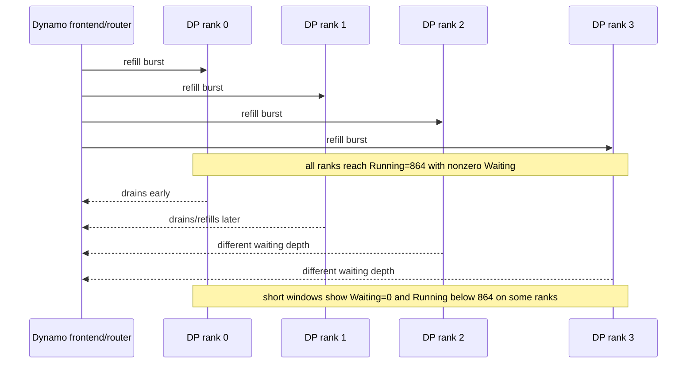

# Post-PR 9915 Dynamo DP Imbalance Rerun

Date: 2026-05-26

## Short Conclusion

The performance issue still reproduces on a Dynamo revision after PR 9915:
`916ac5971d26976bfca76fd479f2247158e10df7`, which includes
`2b980ba10c refactor: Use delta output kind for vLLM token streaming (#9915)`.

The clean post-9915 Dynamo runs are worse than the earlier clean Dynamo runs and
remain well below the earlier direct-vLLM controls. The strongest signal is
still temporal DP-rank imbalance/underfeed: backend ranks repeatedly drain to
`Waiting: 0` and then refill at different times even when final routing is not
known to be statically imbalanced.

## Workload

- Lyris GB200, 1 node, 4 GPUs.
- Model path:
  `/lustre/share/coreai_dlfw_dev/models/Qwen3-235B-A22B-Instruct-2507-FP4`
- Runtime image: `nvcr.io/nvidia/ai-dynamo/vllm-runtime:1.1.0`
- Dynamo installed from source at `916ac5971d26976bfca76fd479f2247158e10df7`
- vLLM backend: DP=4, EP enabled, FP8 KV cache, `max-num-seqs=864`,
  `max-num-batched-tokens=2048`, `max-model-len=2048`, `quantization=modelopt`
- SA-Bench: `isl=2`, `osl=1024`, concurrency `8192`,
  `random_range_ratio=1.0`, chat template disabled

## Results

| Run | Job/session | Output tok/s | Req/s | Mean TTFT | P99 TTFT | Mean TPOT | Mean ITL |
|---|---:|---:|---:|---:|---:|---:|---:|
| Direct vLLM api4/default, prior control | 1859427 | 58,227.52 | 56.86 | 75.42 s | 373.39 s | 62.25 ms | 71.20 ms |
| Direct vLLM api8, prior control | 1864796 | 58,043.19 | 56.68 | 61.15 s | 250.42 s | 68.00 ms | 69.05 ms |
| Dynamo round robin, prior clean | 1859591 | 49,263.13 | 48.11 | 99.92 s | 188.38 s | 57.48 ms | 71.83 ms |
| Dynamo least-loaded, prior clean | 1859711 | 49,309.21 | 48.15 | 98.94 s | 156.63 s | 62.74 ms | 70.10 ms |
| Dynamo dedicated KV, prior clean | 1859688 | 48,990.56 | 47.84 | 103.81 s | 187.54 s | 57.64 ms | 66.44 ms |
| Dynamo round robin, post-9915 | 1912381 | 41,237.16 | 40.27 | 141.56 s | 304.86 s | 46.65 ms | 64.93 ms |
| Dynamo least-loaded, post-9915 | 1913159 | 36,097.19 | 35.25 | 140.55 s | 244.83 s | 80.20 ms | 96.52 ms |
| Dynamo dedicated KV, post-9915 | 1913660 | 37,768.10 | 36.88 | 150.02 s | 275.58 s | 55.27 ms | 81.08 ms |

Throughput, higher is better:

```text
Direct api4 prior        58.23k | ##################################################
Direct api8 prior        58.04k | #################################################
Dynamo least prior       49.31k | ##########################################
Dynamo RR prior          49.26k | ##########################################
Dynamo KV prior          48.99k | ##########################################
Dynamo RR post-9915      41.24k | ###################################
Dynamo KV post-9915      37.77k | ################################
Dynamo least post-9915   36.10k | ###############################
```

Mean TTFT, lower is better:

```text
Direct api8 prior        61.15s | ####################
Direct api4 prior        75.42s | ########################
Dynamo least prior       98.94s | ################################
Dynamo RR prior          99.92s | ################################
Dynamo KV prior         103.81s | ##################################
Dynamo least post-9915  140.55s | ##############################################
Dynamo RR post-9915     141.56s | ###############################################
Dynamo KV post-9915     150.02s | #################################################
```

## Queue Signals

| Post-9915 run | Request-plane queue mean | Send mean | Roundtrip TTFT mean | Frontend queue sample | Backend queue signal |
|---|---:|---:|---:|---|---|
| Round robin 1912381 | 91.53 ms | 17.52 ms | 115.82 s | `queued=6539`, `inflight=8192` at scrape 1500 | ranks later drained to `Waiting: 0`, often `Running < 864` |
| Least-loaded 1913159 | 83.10 ms | 26.98 ms | 127.81 s | `queued=5263`, `inflight=8192` at scrape 2000 | repeated `Waiting: 0` with ranks oscillating between underfilled and full |
| Dedicated KV 1913660 | not extracted | not extracted | not extracted | final scrape captured at `frontend__2280.prom` | early measured rank waiting queues diverged, then drained to `Waiting: 0` |

The local request-plane send/queue means are far below the observed TTFT gap.
Most of the TTFT is inside the request-plane roundtrip to first token, which is
consistent with backend admission/drain timing rather than local HTTP enqueue
cost.

## DP-Rank Pattern



Observed examples:

- Round robin `1912381`: late samples had all visible ranks at `Waiting: 0`
  while `Running` was often in the 300-700 range.
- Least-loaded `1913159`: rank samples included `Running: 337`, `285`, `397`,
  and `371` with `Waiting: 0`, followed by uneven refills.
- Dedicated KV `1913660`: early measured load filled all ranks; then waiting
  queues diverged and later samples had `Waiting: 0` with `Running` in the
  300-700 range on different ranks.

## Interpretation

PR 9915 does not appear to fix this workload. On the pinned post-9915 revision,
round robin is the best throughput variant at 41.24k output tok/s, but it is
about 29.2% lower than prior direct vLLM api4 controls and about 16.3% lower
than the earlier clean Dynamo round-robin run. Least-loaded and dedicated KV
are worse on throughput, and dedicated KV has the worst mean TTFT of the three
post-9915 variants.

The direct-vLLM controls were not rerun in this pass; they are the prior clean
controls. That is acceptable for this specific check because the changed
component is Dynamo, and the post-9915 Dynamo variants are all below both the
prior direct-vLLM controls and the prior clean Dynamo controls.

Even final request distribution is unlikely to be sufficient. The older clean
round-robin run had near-perfect per-rank final counts, yet still had a large
TTFT/throughput gap. The post-9915 runs again point at temporal imbalance:
Dynamo appears to refill/admit DP ranks in bursts that can leave some ranks
underfed while others are still full or draining.

The observed frontend/request-plane metrics do not prove stale backend state
directly. They do show that the large delay is not explained by frontend
enqueue/send overhead. State freshness still needs direct instrumentation:
selected backend, backend load snapshot age, backend enter timestamp,
first-token timestamp, and completion timestamp per request.

For job `1913660`, Lyris socket instability prevented extraction of the final
request-plane histogram sums before this report was written. The benchmark
result and backend queue evidence were captured; the final metrics scrape is
recorded in the output directory and can be parsed later if needed.

## Artifacts

| Run | Output path |
|---|---|
| 1912381 | `/lustre/fsw/coreai_dlfw_dev/connorc/srt-slurm/outputs/1912381` |
| 1913159 | `/lustre/fsw/coreai_dlfw_dev/connorc/srt-slurm/outputs/1913159` |
| 1913660 | `/lustre/fsw/coreai_dlfw_dev/connorc/srt-slurm/outputs/1913660` |

Detailed step log: `RERUN-2026-05-26.md`.

Full causal analysis: `POST-9915-COMPREHENSIVE-REPORT.md`.
